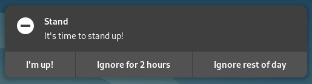

# Stand!

Stand is Linux software to remind you periodically to take a break, stand up from your desk and move around.

**Dependencies**:

- [libnotify](https://packages.debian.org/stable/libnotify-bin)




## Installation

[Download a precompiled binary from the latest release](https://github.com/dannyvankooten/stand/releases/latest) or compile from source (requires a C compiler):

```sh 
make
make install 
```

Make sure libnotify is installed too:

**Debian / Ubuntu**
```sh 
apt-get install libnotify-bin
```

**Arch**
```sh 
pacman -S libnotify 
```


## Usage 


Run `stand` without any arguments to use the default interval of `1 hour`.

```sh 
$ stand 

Stand is now running!
-  Interval: 3600 seconds
-  Next reminder:  7:52 AM
```

You can provide a second argument to specify a custom interval, in seconds. 

```
$ stand 1800

Stand is now running!
-  Interval: 1800 seconds
-  Next reminder:  7:22 AM
```


## License

MIT licensed